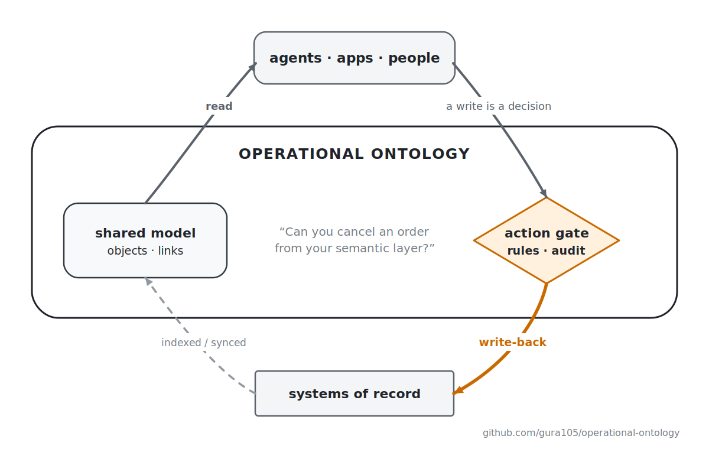
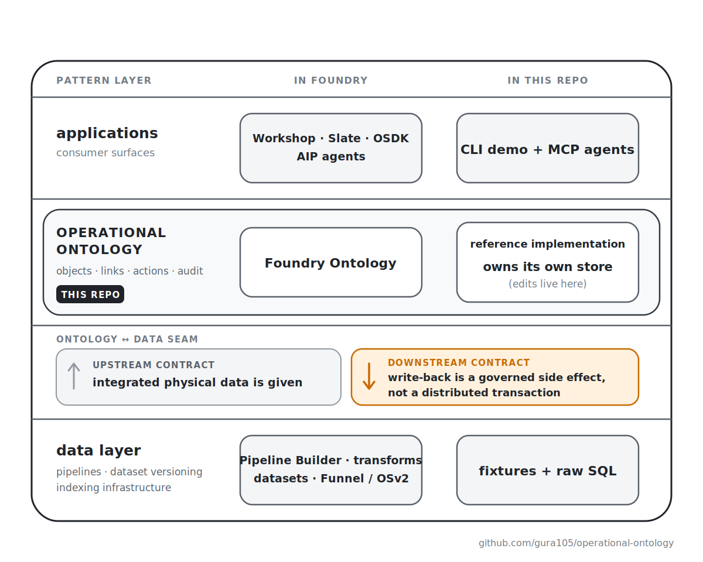

[English](./README.md) | **日本語**

# Operational Ontology

[](https://github.com/gura105/operational-ontology/actions/workflows/ci.yml)
[](./LICENSE)

> **Operational Ontology（操作できるオントロジー）とは、自分たちが所有していないシステム群のデータの上に築かれる共有ドメインモデルである。オブジェクト・リンク・アクションから成り、読み取りはモデルを辿って行われ、書き込みは業務ルールを備えたアクションだけを通る。書き込みはすべて監査され、変更した状態の正本を所有するシステム（システムオブレコード）へと書き戻される。**
>
> セマンティックレイヤーはビジネスを「読む」ためのもの。Operational Ontology はビジネスを「動かす」ためのもの。

<picture>
  <source media="(prefers-color-scheme: dark)" srcset="./assets/hero-diagram-dark.svg">
  
</picture>

Palantir Foundry の Ontology は、このパターンの実装のひとつです。このリポジトリはもうひとつの実装で、一息に読み切れる規模の最小リファレンス実装です。目的は定義を正確かつ実行可能な形にすることで、フレームワークではありません。フォークして、アイデアを自由に使ってください。

## クイックスタート

```sh
pnpm install
pnpm demo    # 物理データ → 統合 → インデックス → 読み取り → 書き込み → 拒否 → 書き戻し
pnpm test    # 同じ振る舞いを、実行可能なテストとして
```

デモの題材は、[このリポジトリの元になった記事](https://x.com/gura105/status/2077153028982133080)と同じシナリオです。ある企業が競合を買収し、スキーマもステータスの表現方法も異なる 2 つのレガシー受注システムを抱え込みます。数十行の SQL と小さな TypeScript のマッピングでこれらを統合し、その上に `Customer` / `Order` / `Product`、さらにどのソースシステムにもテーブルが存在しない型 `Note` をオントロジーとしてモデリングします。デモで確認できるのは次の動作です。

- リンク走査が「この製品を含む注文はどれか？」という問いに、両システムを横断して答える
- `assignOrder` が、どのレガシーシステムにも存在しない状態を書き込む（編集はソースの一段上の層に置ける）
- 出荷済み注文への `cancelOrder` は、`SHIPPED_ORDER_CANNOT_BE_CANCELLED` で拒否される
- 未出荷注文への `cancelOrder` は成功し、レガシー ERP の行が実際に書き換わる
- 稼働中のレガシーシステムを再インデックスすると、注文データは ERP の内容で更新され、担当者とメモ（オントロジー自身が所有する状態）は保持される
- 適用も拒否も含め、すべての試行が監査ログに残る

https://github.com/user-attachments/assets/02bb8ca0-a476-4e33-b0ea-25c46c6e9dda

## 4 つの性質

以下の 4 つがすべて成り立つとき、そのシステムはこのパターンを実装しています。4 つの性質が定めるのは「何が成り立つべきか」であって、「どう作るか」ではありません。outbox か webhook か、SQL か検索インデックスか、ストアは 1 つか複数かは、すべて実装側の選択です。これは取得すべき認定ではなく、システムについて議論するための共有語彙です。

1. **セマンティックなオブジェクトとリンク。** 業務のエンティティとその関係が、先に存在していた物理データ（他のシステムが所有するデータ）の上に、明示的にモデリングされている。

2. **アクションに一本化された書き込み。** 業務上の判断は、名前のついたアクションを通してしか状態を変えられない。汎用の更新経路は、ユーザーにもアプリケーションにもエージェントにも存在しない。この層の状態が変わる理由は他に 2 つあるが、どちらも抜け穴ではない。再インデックスはソースが既に語っていることを再生するだけであり、レビューを経たスキーマ進化が変えるのは「何を言えるか」であって「何が真か」ではない。業務上の結果を選び取る書き込みは、エンドポイントの名前が何であろうと判断であり、判断はアクションを通る。

3. **アクションに紐づく業務ルール。** 事前条件は、ドメインの不変条件（「出荷済みの注文はキャンセルできない」）を検査し、違反を機械可読なエラーとして拒否する。これはアクセス制御でも UI バリデーションでもない。適用された試行も拒否された試行も、すべて監査ログに残る。

4. **システムオブレコードへの書き戻し（write-back）。** モデルは、すべての状態について「どのシステムが正本を持つか」を宣言する。状態は次の 3 種類に分かれる。

   - **source-backed** — 上流システムが正本を持つ状態。たとえば ERP がマスタとして管理する注文の status。これへの変更は、統制された順序つきの副作用としてソースへ書き戻される。正本は元のシステムにあり続ける。
   - **ontology-owned** — どのソースシステムにもカラムが存在しない状態。たとえば担当者やトリアージメモ。この状態については、オントロジー自身のストアが宣言によってシステムオブレコードになる。
   - **derived** — 集計値や件数など、計算されるだけの状態。書き込まれることはない。

   この性質が禁じるのは、正本の所有者が宣言されていない状態です。ソース所有のデータをローカルで書き換えながらソースには書き戻さない構成や、どこに属するか誰も答えられない書き込みは認めません。また、source-backed な書き込みを 1 つも持たない実装は、このパターンの縮小版ではなく、自前のデータベースを持つ普通のアプリケーションです。

見分け方は簡単です。**「あなたのセマンティックレイヤーから、注文をキャンセルできますか？」**

- できないなら、それは読み取り層です。有用ですが、別物です。
- できても、どのシステムオブレコードの行も決して変わらないなら、それは並行データベースです。これも別物です。
- 出荷済みの注文まで文句なくキャンセルできてしまうなら、それはただの書き込み API です。性質 3 こそが違いのすべてです。

## なぜ別の名前が要るのか

このパターンに固有の名前が必要なのは、「オントロジー」という言葉が既に多くの意味を背負っているからです。

| 「オントロジー」と呼ばれるもの | 実体 | 統制された書き込み |
| --- | --- | --- |
| 哲学のオントロジー | 存在するものの研究 | — |
| 形式オントロジー（OWL / RDF） | 機械が推論できる形式意味論 | なし |
| ナレッジグラフ | エンティティと関係のグラフ。データとしては書けるが、操作としては書けない | なし |
| AI コンテキストレイヤー（2026 年の「オントロジー」ブランド製品群） | AI の回答を意味づけする層 | なし |
| **Operational Ontology（Foundry 型）** | 業務ドメインのスキーマ **+ ルールを運ぶアクション** | **ある** |

いずれも用途の異なる正当な道具であり、この表は優劣を示すものではありません。しかし、層に何ができるかを決定づけるただ一つの性質、つまり「業務ルールに統制された書き込みを受け付けるかどうか」は、表のすべての行を横断する軸でありながら固有の名前を持っていませんでした。このリポジトリは、それに名前を与えます。

## 実装が宣言すべきもの

4 つの性質は実装機構を規定しませんが、実装ごとに異なり、かつユーザーから観測できてしまう選択がいくつかあります。これらは沈黙せず、宣言しなければなりません。項目は 4 つです。

- **Authority** — どの状態が source-backed で、どれが ontology-owned で、どれが derived か。
- **失敗時のセマンティクス** — write-back とローカルコミットが食い違ったとき、何が起きるか。
- **再インデックスと編集** — ontology-owned な状態は、ベースの更新後も保持されるか。
- **Visibility のデフォルト** — ポリシーを持たないオブジェクトは、見える側と見えない側のどちらに倒れるか。

本リポジトリの答えを、同じ順に示します。所有はモデルの中で宣言します。`owned` が ontology-owned なプロパティ・リンク型・オブジェクト型に印を付け、アクションの `writeback: true` がその変更を source-backed と宣言します。ランタイムは宣言を信用せず、すべての編集プランを宣言に照らして検査します（[詳細](./IMPLEMENTATION.ja.md#authority-の検査)）。write-back はローカルコミットより先に走るため、ソースが拒否すればオントロジー側は何も変わりません（[失敗時のセマンティクス](#失敗時のセマンティクス)参照）。ontology-owned な状態は再インデックス後も保持されます。編集はオーバーレイに置かれ、`load()` が新しいベースの上に再適用します。編集を取り残してしまう再インデックスは丸ごと拒否されます。Visibility のデフォルトは fail-open で、ポリシーがなければ全員に見えます（[FAQ](#faq) 参照）。

この 4 つの答えは、ランタイムが持つ 1 つの列挙可能な値 `Runtime.declarations` にも集約されています。散文を信じてもらうのではなく、実行時に読める形の宣言です。4 つすべてに本リポジトリと違う答えを出しても、パターンの内側であることに変わりはありません。ある製品が Operational Ontology を名乗っていたら、証明書ではなく、この 4 つへの答えを尋ねてください。

## AI エージェント向け（MCP）

```sh
pnpm mcp     # 同じオントロジーを stdio 経由でエージェントに公開
```

MCP のツール群はモデルから生成されます。`search_order`、`traverse_customer_orders`、`cancel_order`、`read_audit_log` など、クエリの種類ごと・アクションごとに 1 ツールです。ここから 2 つの帰結が生まれます。

- **raw SQL ツールは存在しません。** エージェントに公開されるのは、モデルが定義する操作だけです。それ以外はありません。
- **人間に課されるのと同じ事前条件が、エージェントにも課されます。** エージェントが出荷済み注文のキャンセルを試みると、`{ "error": { "code": "SHIPPED_ORDER_CANNOT_BE_CANCELLED", … } }` が返ります。読んで、リカバリーして、ユーザーに説明できる、機械可読な拒否です。

読み取りも同じ方法でスコープされます。すべてのクエリは actor（その呼び出しが誰の代理として行われるかを示す identity）として実行され、モデルに付いた可視性ポリシーが、その actor に見えるオブジェクトを決めます。エージェントのセッションも例外ではありません。唯一の宣言された例外は監査ログで、これは無スコープの管理者向けビューです。なお stdio 経由では、すべての呼び出し元が 1 つの actor にまとめられます。`OO_AGENT=<name> pnpm mcp` でその actor に名前を付けられますが、これはラベリングであって認証ではありません。

https://github.com/user-attachments/assets/2b811ee7-bff2-4694-b3bf-bf0f6ccc85d5

**業務ルールはプロンプトではなく、オントロジーに宿ります。**

| アプローチ | 読み取り | 書き込み | ルールの担保 |
| --- | --- | --- | --- |
| DB 直結（SQL ツール / DB MCP） | テーブル | 無制限の `UPDATE` | なし（せいぜいプロンプト頼み） |
| セマンティックレイヤー / メトリクス MCP | 統制されたメトリクス | — | 対象外（読み取り専用） |
| API ラッパーツール | エンドポイント | エンドポイント単位 | 各バックエンドでバラバラ |
| **Operational Ontology** | オブジェクト・リンク・集計 | **名前つきアクションのみ** | **モデル内の事前条件、監査つき** |

## パターン

概念は 5 つ。オブジェクト、リンク、アクション、edits（編集）、そして監査ログです。すべてデータとして定義され、ランタイム（`src/core.ts`）が解釈します。

```ts
const ontology = defineOntology({
  name: 'orders',
  objects: {
    Customer: defineObject({
      primaryKey: 'id',
      properties: { id: z.string(), name: z.string(), region: z.string() },
    }),
    Order: defineObject({
      primaryKey: 'id',
      properties: {
        id: z.string(),
        status: z.enum(['pending', 'shipped', 'cancelled']),
        total: z.number().int(), // minor units — お金は float ではない
        assignee: z.string().nullable(),
      },
      owned: { assignee: null },                       // オントロジー自身の状態、と宣言する
      source: 'north.tbl_order ∪ south.SALES_ORDER',   // 物理データが先にある
    }),
  },
  links: {
    customerOrders: defineLink({ from: 'Customer', to: 'Order', kind: 'one-to-many' }),
  },
  actions: {
    cancelOrder: defineAction({
      object: 'Order',
      targetParam: 'orderId',
      params: { orderId: z.string(), reason: z.string().min(1) },
      preconditions: [
        ({ object }) => object.status === 'shipped'
          ? reject('SHIPPED_ORDER_CANNOT_BE_CANCELLED', `order ${object.id} has already shipped`)
          : undefined,
      ],
      effects: ({ object }) => [modify('Order', object.id, { status: 'cancelled' })],
      writeback: true,
    }),
  },
})
```

定義がただの値であることには実利があります。列挙でき、diff が取れ、バージョン管理できます。前述の MCP ツール群も、この定義から機械的に導出されています。

業務操作としての書き込み API は `Runtime.execute()` ただ 1 つで、常に次の順序で処理します。

1. パラメータを検証する
2. 事前条件を評価する
3. 効果関数を実行する（編集プランを返すだけで、自分では何も適用しない）
4. プラン全体を、コミットと同じコードでドライランし、ロールバックする
5. プランを authority 宣言に照らして検査する
6. システムオブレコードへ書き戻す
7. 編集と監査エントリを 1 つのトランザクションでコミットする

ただし、この一本化は API 上の契約であって、権限境界ではありません。ランタイムは呼び出し側と同じプロセスで動くため、データベースハンドルを直接握っているコードはこのゲートを迂回できます（[詳細](./IMPLEMENTATION.ja.md#トランザクションの所有権)）。`load()` は別系統のインフラ用 API です。ソースを再インデックスするもので、業務判断を実行するものではありません。

読み取りにも identity が流れます。すべての `search` / `get` / `traverse` / `aggregate` は `actor` として実行され、オブジェクト型には `visibility` 述語を付けられます。行レベルセキュリティの最小形が、他のすべてと同じくモデルの中にあるということです。隠されたオブジェクトは、読み取りでもアクションのターゲットとしても、存在しないオブジェクトと区別できません。

編集（edits）もデータです。種類は `modify`、`create`、そして `link` / `unlink`。つまりアクションはプロパティだけでなく、リンクのインスタンスも変更できます。リンクの型はモデルの一部でありここでは変わりませんが、どのオブジェクト間にリンクが存在するかは状態であり、アクションを通してしか変わりません。多重度も検査され、1 つの注文に顧客が 2 人つくような `link` はランタイムが拒否します。「注文を別の顧客に付け替える」は unlink と link の組で、他のすべてと同じ事前条件のもと、原子的に適用されます。生成も同じゲートを通ります。デモの `addOrderNote` は、ontology-owned なノートを生成して注文にリンクするところまでを 1 つの原子的なプランで行います。削除はこの版ではスコープ外です（[ステータス](#ステータス)参照）。モデル自体の変更（新しいオブジェクト型やリンク型の追加）はスキーマ進化の話です（FAQ 参照）。

モデルをクラスではなくデータで表すのには、実用上の理由があります。`class Order { cancel() {} }` は、リフレクション層を追加しない限り、エージェント用ツールへの列挙も、複数アプリケーションでの共有も、実行時の内省もできません。シグネチャは事前条件について何も語りません。クラスベースのドメイン層は 1 つのアプリケーションの私有物であり、このパターンの眼目は、ドメイン層を共有物にすることにあります。

## この実装の立ち位置

3 層のうち、このリポジトリが実装するのは中間の 1 層だけです。

<picture>
  <source media="(prefers-color-scheme: dark)" srcset="./assets/where-this-sits-dark.svg">
  
</picture>

**上流（データ基盤）との契約**：統合済みの物理データは与えられるもの。パイプライン、データセットのトランザクション、ロールバックはデータ基盤の仕事です。

**下流（システムオブレコード）との契約**：書き戻しは統制された副作用であって、分散トランザクションではありません（後述）。

クエリ側の層との違いを 1 つ明記しておきます。クエリに答えるだけの層は仮想のままでいられますが、書き込みを受け付ける層は状態を所有しなければなりません。編集は、システムオブレコードより先に、あるいはその代わりに、この層に存在します（`assignOrder` が書くのは、どのレガシーにもカラムがない ontology-owned な状態です）。だからオントロジーは自前のストアと監査ログを持ちます。一方、エンタープライズ規模で読み取りを速くするインデクシング機構（インクリメンタルインデックス、隣接インデックス、検索バックエンド）は持ちません。それは Foundry が数十億オブジェクトを捌くための手段であり、この層のある実装の事情であって、パターンの一部ではありません。

## 失敗時のセマンティクス

**パターンが要求すること。** パターンは、オントロジーとシステムオブレコードの間の整合性機構を規定しません。分散トランザクション、順序契約、outbox、照合ジョブはどれも実装側の選択です。その代わり、失敗時の挙動は必ず**宣言**することを要求します。内部機構と違って失敗時の挙動は観測可能で、ユーザーはシステムが乖離していく様子を見られるからです。宣言された乖離はエンジニアリングで扱える問題ですが、本番で初めて発覚する乖離はインシデントです。

**本実装の宣言。** `WritebackAdapter` はローカルコミットより先に走ります。これは Foundry の write-back webhook と同じ順序です（Foundry の 2 モードのうちの 1 つで、もう一方は編集の後に副作用を走らせます）。帰結は 2 つあります。

- システムオブレコードが拒否した場合、オントロジー側は何も変わりません。
- 逆向きの失敗（アダプタは成功したがローカルコミットが失敗した）の可能性は残ります。これが起きたとき両システムは乖離しており、突き合わせと解消（照合、reconciliation）は運用側の仕事です。[Palantir の webhook ドキュメント](https://www.palantir.com/docs/foundry/action-types/webhooks)も、Foundry の write-back モードに同じギャップがあることを認めています。

このリスクを、3 つの仕組みが狭めています（[機構の詳細](./IMPLEMENTATION.ja.md#失敗時のセマンティクスの詳細)）。第一に、不正なデータはシステムオブレコードに届きません。アダプタが走る前に、編集プラン全体がコミットと同じコードでドライランされるからです。第二に、監査ログはどちら向きの失敗でもプラン全体を記録し、照合の材料になります。第三に、「すべての試行は監査される」が意味するのは、このランタイムが完了まで観測できた試行のすべてです。自分のストアの内側では、ランタイムはトランザクショナルです。アクションの編集と監査エントリは 1 つの SQLite トランザクションで原子的にコミットされ、拒否された試行も記録されます。

**事前条件と鮮度。** 保証すること：事前条件は、オントロジーストア（最後にインデックスされたスナップショット + 適用済みの編集）に対して成立します。保証しないこと：write-back のステップはソース側で不変条件を再検証しないため、ソースがオントロジーの知らないところで変わっていれば、ソース側では不変条件が崩れている可能性があります。この隙間を狭めるのはアダプタの役割です。条件付き write-back、compare-and-set、ソース側での再検証などが選択肢で、デモのアダプタはガード付き `UPDATE` を使い、古くなったキャンセルを ERP 自身が拒否できるようにしています。

**並行編集。** 保証すること：本実装は同期的なシングルライターで、アクションはランタイムに直列化され、一度に 1 つずつ実行されます。また、呼び出し側が開いたトランザクションの中では実行を拒否するため、コミットと監査を終えたアクションが成功報告の後に巻き戻されることはありません。保証しないこと：`WritebackAdapter` インターフェースは同期であり、ネットワーク越しの本物の write-back はこの直列化を壊します。そこへ進む実装は、代わりに何が直列性を保証するのかを宣言しなければなりません。ストア境界の残りは、防御ではなく宣言された契約です。ルールとアダプタはオントロジーストアに触れてはならない、という契約で、データベースハンドルを握ったコードをプロセス内の検査で止めることはできません（[詳細](./IMPLEMENTATION.ja.md#トランザクションの所有権)）。

**再インデックスと編集。** ストアには、ソースからインデックスされたベースと、その上にアクションが積んだ編集という 2 種類の状態があります。ソースは動き続けるので、再インデックスが編集に出会ったときの挙動を必ず決めなければなりません。本実装は Foundry と同じ形の最小化です。スナップショットが供給できるのは source-backed な状態だけ。ontology-owned なプロパティへの編集はオーバーレイに保持され、新しいベースの上に再適用されます。ontology-owned な型とリンクには `load()` は一切触れません。そして、ontology-owned な編集を取り残してしまう再インデックスは丸ごと拒否され、以前の状態がそのまま残ります。それは照合上の判断であり、ランタイムは照合上の判断を黙って下さないからです。削除と編集が衝突した場合や部分スナップショットを含む完全な規則は、[実装ノート](./IMPLEMENTATION.ja.md#再インデックスと編集)にあります。

## Non-goals（作らないもの）

リファレンス実装を一息に読み切れる規模に保つため、v0 のスコープは以下に凍結しています。

- **UI ビルダーは作らない。** アプリケーションはオントロジーの消費者であって、オントロジーの一部ではない。
- **パイプラインフレームワークは作らない。** 統合は前提条件。デモは素の SQL で済ませている。
- **インデクシング基盤は作らない。** デモの規模なら素朴なクエリで十分。スケールは実装の性質であって、パターンの性質ではない。v0 では結果セットに上限を設けていない。
- **フェデレーションは扱わない。** 1 つのオントロジーは 1 つの bounded context。モデルが複数あるとき誰が所有するのかは現実の問題だが、スキーマ進化と同様に v0 では扱わない。
- **リンク属性・複合主キーは（まだ）ない。** デモの注文明細の数量は、意図してデータ層に置いたままにしている。第一級の `OrderLine` にするか、リンクの属性にするかは次版の決定事項。
- **OWL/RDF 対応はしない。** 学術的なオントロジーはセマンティックのみでアクションを持たない。別の仕事のための別の道具。
- **汎用の認可システムは作らない。** パターンレベルの部分はここにある。identity はすべての呼び出しを流れ（宣言済みの例外は監査ログの管理者ビュー）、可視性はモデルに付く。機構（グループ、属性、ポリシー言語、セルレベルセキュリティ、伝播）はポリシーエンジンの仕事。
- **npm パッケージにはしない。** フォークして使うもので、依存するものではない。
- **Foundry の代替ではない。** Foundry は 3 層すべてを垂直統合した実装。このリポジトリは中間層に名前を与え、動かして見せる。

## Prior art（先行事例）

- **Palantir Foundry Ontology** — このパターンの抽出元。[semantic/kinetic の語彙](https://www.palantir.com/docs/foundry/ontology/overview)、[action types](https://www.palantir.com/docs/foundry/action-types/overview)、[write-back webhooks](https://www.palantir.com/docs/foundry/action-types/webhooks)、Ontology MCP を含む。本リポジトリは、特定ベンダーに依存しない形でパターンを記述する。
- **DDD、CQRS、イベントソーシング** — 部品は意図して古い。エンティティ、集約、コマンド、ガード付きの状態遷移、追記型ログ。新しいのは配置で、ドメイン層を単一アプリケーションから引き上げ、他システムのデータの上に置き、多数のアプリとエージェントで共有する。
- **セマンティックレイヤー**（dbt、Cube、AtScale など）と**ナレッジグラフ / OWL / RDF** — 統制された読み取りはあるが、統制された書き込みはない。このパターンの対比先となる隣接カテゴリ。
- **"Operational ontology"** — この語そのものに先行使用がある。学術的なオントロジー工学では別の意味で散発的に使われてきた。一方、Vladimir Kozlov の 2025 年の LinkedIn 記事 2 本（[定義エッセイ](https://www.linkedin.com/pulse/operational-ontology-semantic-interface-between-data-action-kozlov-njnle)、[Foundry 入門](https://www.linkedin.com/pulse/understanding-palantirs-operational-ontology-beginners-kozlov-d0vse)）は、このリポジトリと同じ系譜、つまりセマンティクスだけでなくアクションを備えた Foundry 流のモデルに対してこの語を当てている。このリポジトリが加えるのは、テスト可能な境界（write-back と監査を含む 4 つの性質）と、そのリファレンス実装である。

## FAQ

**これはバリデーション付き CRUD では？** 部品は馴染みのあるものですが、構成が違います。CRUD のバリデーションは 1 つのアプリの内側、そのアプリが所有するテーブルの上にあります。ここではモデルが他システムの所有するデータの上に載り、すべての消費者（UI・スクリプト・エージェント）に共有され、アクション以外の書き込み経路を閉じ、全試行を監査し、受理した変更をシステムオブレコードへ書き戻します。既存の言葉で最も近いのは、「アプリケーションから取り出され、他システムのデータの上に置かれた CQRS のコマンド層」です。

**ナレッジグラフだって書き込めるのでは？** 書き込めます。SPARQL UPDATE で `status = 'cancelled'` に書き換えられますし、`WHERE` 句や SHACL のシェイプで条件付きにもできます。トリプルストアが 1 つの第一級ユニットとして提供しないのは、契約の残りの部分です。名前のついた業務操作、機械可読な拒否、試行の監査証跡、システムオブレコードへの書き戻し。違いは能力ではなく（トリプルストアの上にすべて構築することは可能です）、モデルから何が名前付き・統制付き・第一級のものとして出てくるか、です。

**なぜ OWL/RDF ではないのか？** それらはモノが「何であるか」（セマンティック）のモデルです。このパターンの半分は「何ができるか」（キネティック）にあります。アクション、事前条件、監査、書き戻し。推論器に注文はキャンセルできません。

**なぜ YAML ではなく TypeScript で定義するのか？** 業務ルールはコードだからです。YAML に埋め込まれたルール式言語は、場当たり的なルールエンジンに育ちがちです。TypeScript のオブジェクトリテラルなら、モデルの列挙可能性を保ったまま、ルールを普通の型付きコードとして書けます（型が効くのは言語のレベルまでで、モデル自身のスキーマに対する型検査はまだありません。[ステータス](#ステータス)参照）。構造はデータ、ルールは関数。Foundry が Ontology Manager と Functions の間で行っているのと同じ分割です。

**トランザクションとロールバックは？** 3 つのドメインに 3 つの答えがあります。データセットの版管理とロールバックはデータ層の仕事（Foundry ではカタログのトランザクションとブランチ）。アクションの編集を原子的に適用するのはこの層の仕事（ここでは実際の SQLite トランザクションで実装）。システム横断の write-back の整合性機構は実装定義であり、パターンが要求するのは宣言です。本実装は write-back 先行の順序を宣言しています（[失敗時のセマンティクス](#失敗時のセマンティクス)参照）。

**権限・セキュリティは？** この質問には 3 つの別物が隠れています。

- **認証**はパターンの外です。identity は確立済みのものとして渡されてきます。本実装の `actor` は自己申告の文字列で、示しているのは配置であって保護ではありません。
- **認可**は、その配置がパターンの一部です。ポリシーはオブジェクト型とアクションに付き、すべての消費者の読み書きを等しく拘束します（Foundry が dynamic security をオントロジーのキネティック要素に数えるのと同じ考え方です）。一方、機構（グループ、属性、ポリシー言語、セルレベルセキュリティ、伝播）は実装定義です。
- **事前条件**はどちらでもありません。妥当性の話であって、権限の話ではありません。

この区別はエージェントにとって重要です。それぞれからのリカバリー方法が違うからです。

- **visibility** — あなたには見えない
- **permission** — あなたにはできない
- **precondition** — 誰にもできない

（Foundry は submission criteria の中で permission と妥当性を混ぜていますが、それでもパターンには適合します。この分離は推奨であって要求ではありません。）

ここから設計判断が 2 つ導かれます。`preconditions` は必須キーで、空リストは「条件なし」という明示的な決定です。ゲート付き書き込みがパターンの核である以上、条件の不在もデフォルトではなく表明であるべきだからです。`visibility` は省略可能なキーです。認可が存在するかどうか自体が実装定義だからで、省略すれば全員に見えます（**fail-open**）。認証を持たない参照実装は意味のある fail-closed になれないため、なれるふりもしません。Foundry のベースラインは正反対で、任意（discretionary）の grant がゼロからアクセスを広げ、強制（mandatory）の marking がその上から拒否を重ねます。fail-closed な配備は `visibility` の必須化から始まりますが、それだけでは足りず、本物の認証、アクション権限、スコープされた監査アクセスが下に必要です。宣言済みの面をもう 1 つ：監査ログの読み取り API は無スコープです。visibility フィルタが適用されない、管理者向けのビューです。

**Foundry の Functions と派生プロパティは？** Foundry はキネティック要素を 3 つ数えます：actions、functions、dynamic security。function-backed な action は既にこのパターンの内側です。事前条件と効果は変更を記述するだけの普通のコードで、効果は編集プランを返すだけ、副作用はアダプタの仕事です。読み取り時の計算（派生プロパティ、クエリ関数）は意図的に対象外です。このパターンの差別化要素は統制された書き込みであって、計算された読み取りではないからです。dynamic security は上の権限の話に含まれます。

**エージェントがリトライしたら？** 本実装に冪等キーはありません。リトライされた `cancelOrder` は自分自身の事前条件（`ORDER_ALREADY_CANCELLED`）に拒否されます。これはルールの働きによる自然な冪等性であって、保証ではありません。また、write-back と交錯するリトライは、ソース側で副作用を二重に適用する可能性があります。アクションが自然に冪等でない場合の最小の出発点は、params に invocation id を入れることです（他のすべてと同じく監査に載ります）。ただし、それで得られるのは相関までで、実際の重複排除にはその id への一意性チェックが必要です。冪等性は実装定義ですが、エージェントは実際にリトライするので、宣言する価値があります。

**オントロジー自体は、どう変化していく？** スキーマ進化（新しいオブジェクト型、プロパティの変更、リンクの廃止）は現実の問題ですが、フェデレーションと同じくスコープ外です。Foundry にはバージョニングとプロポーザルの機構があり、学術分野では ontology evolution として研究されています。このリポジトリが提供するのは、安全に進化するための前提条件です。モデルはただの値なので、他のコードと同じように diff を取り、バージョン管理し、レビューできます。ドメインモデリングは一回きりの工程ではなく、モデルはビジネスに合わせて調整され続けます。

**フロントエンドは自前で用意する？** はい。アプリケーションとの契約は 2 種類の呼び出し、クエリ（`search`/`get`/`traverse`/`aggregate`）と `execute(action)` だけです。人間もエージェントも同じで、すべての呼び出しは actor として行われます。ダッシュボードは前者を、「キャンセル」ボタンは後者を使います。ルールが従うのはモデルであって、フロントエンドではありません。

## ステータス

v0.2 — リファレンス実装。この版では、4 つの性質を超えて本実装が勝手に誓っていたことを強制する機構（正規形ストレージ検査、外部トランザクション検知、ターゲットレスアクション、プロパティへ鏡写しされるリンク、削除）を取り除き、宣言された契約に置き換えました。ランタイムは一息に読み切れる分量のままで、4 つの性質は 1 つも損なわれていません。

現時点の制約は、そのまま次版の作業リストです。

- source-backed と ontology-owned の両方を変える編集プランは丸ごと拒否する。edit 単位のルーティングは未対応
- 生成は ontology-owned な型に限る。write-back で運ぶ source-backed な生成は未実証
- 削除は未対応
- リンク属性と複合主キーは未対応
- ルールコンテキストの型付けは不完全
- ネストしたプロパティの strict な検証は未対応

本実装の宣言を支える機構の詳細は[実装ノート](./IMPLEMENTATION.ja.md)にまとめてあります。Node 24、better-sqlite3、zod 4、MCP SDK 1.29 でビルド・検証済み。

MIT © gura105
