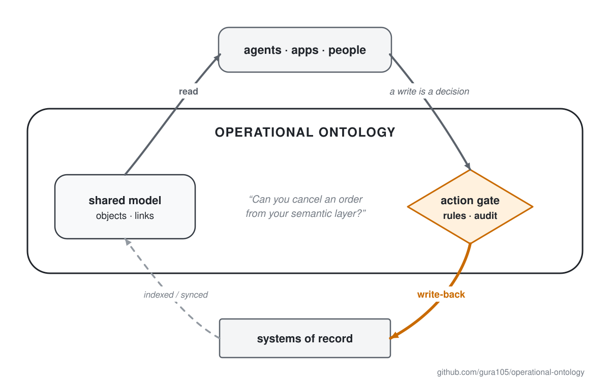
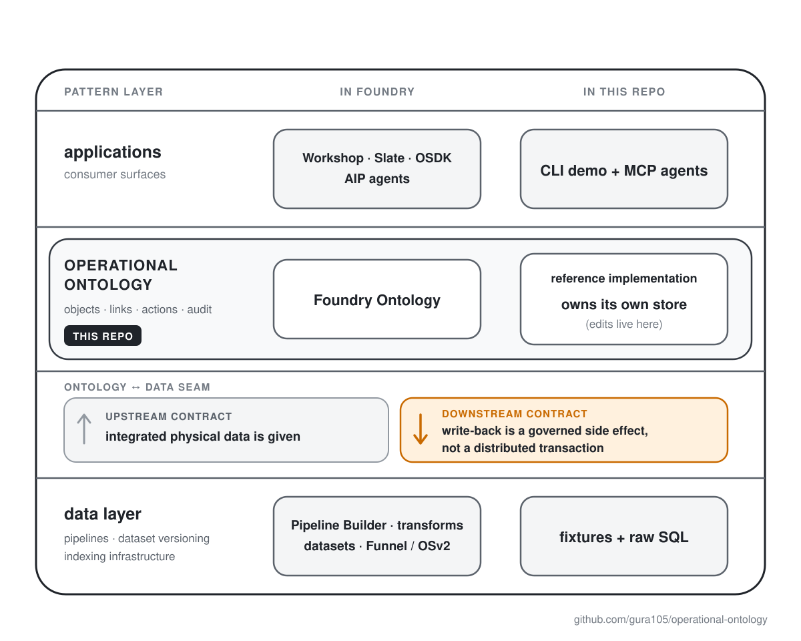

[English](./README.md) | **日本語**

# Operational Ontology

[](https://github.com/gura105/operational-ontology/actions/workflows/ci.yml)
[](./LICENSE)

> **Operational Ontology（操作できるオントロジー）とは、他システムのデータの上に築く共有ドメインモデルです。オブジェクトとリンクで業務を読み取り、アクションで業務ルールを検査し、試行を監査し、変更をシステムオブレコードへ書き戻します。**
>
> セマンティックレイヤーはビジネスを「読む」ためのもの。Operational Ontology はビジネスを「動かす」ためのもの。



このリポジトリは、その定義を小さな TypeScript のリファレンス実装として動かします。Palantir Foundry の Ontology からパターンを取り出し、読んで、フォークして、アイデアを応用できる形にしています。学習用の実装であり、フレームワークや依存用の npm パッケージではありません。

## クイックスタート

Node.js 24 以降と pnpm が必要です。

```sh
pnpm install
pnpm demo    # 物理データ → 統合 → インデックス → 読み取り → 書き込み → 拒否 → 書き戻し
pnpm test    # 振る舞いを検証する
```

デモは[このリポジトリの元になった記事](https://note.com/gura105/n/nfe927c169c6a)のシナリオに沿っています。企業買収によって、**スキーマもステータスの表現も異なる2つのレガシー受注システム**を抱えた企業を想定し、SQL と小さなマッピングでデータを1つのモデルに統合します。実行すると、次の動作を確認できます。

- リンク走査と集計が、両システムを横断した問いに答える。
- `cancelOrder` が出荷済み注文を拒否し、受理したキャンセルを元の ERP に書き戻す。
- `assignOrder` と `addOrderNote` がオントロジー自身の状態を保存する。再インデックスでソースのデータが更新されても、担当者とメモは残る。
- 適用も拒否も含め、アクションの試行が監査ログに残る。

https://github.com/user-attachments/assets/02bb8ca0-a476-4e33-b0ea-25c46c6e9dda

次の3例では、関係と条件から対応対象を探し、判断とその根拠を残すところまで辿ります。

| 例 | 業務上の問いと対応 | 実行 |
| --- | --- | --- |
| [工場](./examples/factory/README.ja.md) | 影響が疑われるロットの出荷先はどこか。顧客連絡・再検査の検討タスクを作る。 | `pnpm demo:factory` |
| [病院](./examples/hospital/README.ja.md) | 患者の要件を満たす病床と看護師はどれか。仮割当を記録する。 | `pnpm demo:hospital` |
| [金融](./examples/finance/README.ja.md) | 対象口座に共通する受取先はどこか。根拠取引とともに調査ケースを記録する。 | `pnpm demo:finance` |

いずれも架空のデータを使い、集合の探索とモデルに定義した業務ルールを組み合わせます。候補や共通する関係が見つかっただけでは、判断の確定や業務状態の変更にはなりません。

## なぜ Operational Ontology を定義するのか

「この顧客に未出荷の注文はいくつあるか」に一貫した意味で答えるには、データを業務の言葉で読むためのモデルが必要です。さらにアプリケーションや AI エージェントが「その注文をキャンセルする」ときには、操作の条件を検査し、試行を記録し、注文データを管理する ERP へ変更を届ける仕組みも必要になります。この一連の責務を共有モデルとして捉えることが、このリポジトリの出発点です。

セマンティックレイヤーや「オントロジー」という言葉だけでは、どこまでの責務を含むのかが分かりません。近い概念を、何をモデル化し、業務操作をどう扱うかで比べると、違いが見えます。

| 概念・構成 | 主にモデル化するもの | 業務操作との関係 |
| --- | --- | --- |
| セマンティックレイヤー | 指標・属性・集計の意味 | データへの問いに一貫して答える。操作の条件や書き戻しは別途設計する。 |
| 形式オントロジー・ナレッジグラフ | 概念の意味、エンティティと関係 | 意味や関係を表現する。データの更新に加えて、業務操作のルールや監査をどう組み込むかを設計する。 |
| AI コンテキストレイヤー | 回答や判断に必要な意味・背景情報 | エージェントの理解を支える。実行する操作の統制は別途設計する。 |
| CRUD API・API ラッパー | データアクセスや個々の処理 | ルール・監査・書き戻しをどこで担保するかは、各 API の設計による。 |
| **Operational Ontology** | **共有するオブジェクト・リンクと、ルールを備えたアクション** | **業務操作の条件・監査・データの管理元への書き戻しを、共有モデルの契約として定める。** |

これらの技術は組み合わせて使えます。ここで名前を付けたいのは、**すべての消費者が同じモデルを通じて、同じ業務ルールのもとで状態を変える構成**です。Foundry の Ontology からこの構成を取り出し、特定製品に依存せず議論・実装できるよう、Operational Ontology として次の4つの性質で定義します。

## 4つの性質

このリポジトリでは、次の4つがすべて成り立つシステムを Operational Ontology と呼びます。これらがパターンを定め、ストレージ、統合ツール、整合性を取る機構は各実装が選びます。

1. **セマンティックなオブジェクトとリンク。** 他システムが所有する既存データの上に、業務のエンティティと関係を明示的にモデル化します。
2. **アクションに一本化された書き込み。** 業務上の判断による状態変更は、名前付きアクションだけを通ります。すべての消費者が同じ API を使います。ソースの再インデックスは別のインフラ操作です。
3. **アクションに紐づく業務ルール。** 「出荷済み注文はキャンセルできない」といった不変条件を事前条件で検査します。違反には機械可読な拒否を返し、適用・拒否の両方を監査します。業務上の妥当性を決めるルールと、誰が操作できるかを決めるアクセス制御は別の役割です。
4. **システムオブレコードへの書き戻し。** 状態ごとに管理を担うシステムを宣言し、ソースが所有する状態の変更を、統制された副作用としてそのソースへ届けます。実際にソースが所有する状態を書き換えるところまでが、このパターンに含まれます。

デモでは、状態の所有を3種類に分けています。

- **source-backed：** `Order.status` は ERP が管理し、キャンセルの結果も ERP に書き戻します。
- **ontology-owned：** ソースにカラムのない担当者やメモは、オントロジー自身が所有します。
- **derived：** 合計や件数はクエリ時に計算し、書き込みません。


## コードで見るパターン

モデルは、オブジェクト型・リンク型・アクション型を含む普通の値です。この3種類の定義には、実行時のインスタンスが対応します。

| 定義（型） | 実行時のインスタンス |
| --- | --- |
| オブジェクト型：`Order` | 個々の注文とそのプロパティ |
| リンク型：`customerOrders` | ある顧客とある注文のつながり |
| アクション型：`cancelOrder` | ある注文のキャンセルを試みた1回の呼び出し |

edits は、アクションが記述するオブジェクトやリンクへの変更です。監査ログは、適用・拒否を含むアクションの実行試行とその結果を記録します。定義はコードとして管理し、インスタンスの状態や実行の記録はストアに保持します。

「割当可能な設備を探す」といった業務上の問いを、読み取り専用の **Function** としてモデルに定義できます。利用者は検索条件を個別に実装せず、共通の業務ルールに基づく結果を得られます。

モデルをクラスではなくデータで表すのは、操作に必要な情報を列挙できるようにするためです。`class Order { cancel() {} }` のメソッドシグネチャだけでは、パラメータの検証規則や事前条件は取り出せません。この実装はそれらを定義の値として持たせ、複数のアプリから同じモデルを使い、実行時に内容を調べたり MCP ツールを生成したりできる形にしています。

次の抜粋では、キャンセルの条件を、アクションのパラメータと変更内容とともに定義しています。import とモデル全体は [`examples/orders/ontology.ts`](./examples/orders/ontology.ts) にあります。

```ts
const objects = {
  Customer: defineObject({
    primaryKey: 'id',
    properties: { id: z.string(), name: z.string(), region: z.string() },
  }),
  Order: defineObject({
    primaryKey: 'id',
    properties: {
      id: z.string(),
      status: z.enum(['pending', 'shipped', 'cancelled']),
      total: z.number().int(), // minor units — お金は float ではない
      assignee: z.string().nullable(),
    },
    owned: { assignee: null },                       // オントロジー自身の状態、と宣言する
    source: 'north.tbl_order ∪ south.SALES_ORDER',   // 物理データが先にある
  }),
}

const ontology = defineOntology({
  name: 'orders',
  objects,
  links: {
    customerOrders: defineLink({ from: 'Customer', to: 'Order', kind: 'one-to-many' }),
  },
  actions: {
    cancelOrder: defineAction(objects, {
      object: 'Order',
      targetParam: 'orderId',
      params: { orderId: z.string(), reason: z.string().min(1) },
      preconditions: [
        ({ object }) => object.properties.status === 'shipped'
          ? reject('SHIPPED_ORDER_CANNOT_BE_CANCELLED', `order ${object.pk} has already shipped`)
          : undefined,
      ],
      effects: ({ object }) => [modify(object, { status: 'cancelled' })],
      writeback: true,
    }),
  },
})
```

`execute('cancelOrder', …)` を呼ぶと、対象を読み込み、ルールを検査します。受理する場合は編集プランを検証してソースへ書き戻し、ローカルの編集と監査エントリをコミットします。effects 関数は変更を記述するだけで、外部への書き込みはアダプタが担当します。


## AI エージェント向け（MCP）

```sh
pnpm mcp     # 同じオントロジーを stdio 経由で公開
```

モデルから `search_order`、`traverse_customer_orders`、`cancel_order`、`read_audit_log` などのツールが生成されます。エージェントが出荷済み注文をキャンセルすると、人間の呼び出しと同じく `SHIPPED_ORDER_CANNOT_BE_CANCELLED` が返ります。業務ルールはモデルにあるため、プロンプトにルールの強制を任せる必要がありません。

リポジトリの [MCP 設定](./.mcp.json)で注文デモに接続できます。取得したデータのfilterはエージェント自身のコード実行環境で行います。その流れと入力形式は[実装ノート](./IMPLEMENTATION.ja.md#mcp-のクエリ入力)、呼び出し元の扱いは[identityの説明](./IMPLEMENTATION.ja.md#可視性と呼び出し元の-identity)を参照してください。

https://github.com/user-attachments/assets/2b811ee7-bff2-4694-b3bf-bf0f6ccc85d5

## コードの読み方

最初の3ファイルでモデルと動作を追い、関心のある処理を残りのファイルで確認してください。

| ファイル | 読むポイント |
| --- | --- |
| [`examples/orders/ontology.ts`](./examples/orders/ontology.ts) | オブジェクト・関係・所有・アクションのルールという業務モデル。 |
| [`examples/orders/demo.ts`](./examples/orders/demo.ts) | 読み取り、書き込みの成功と拒否、再インデックスを呼び出し側から確認する。 |
| [`src/core.ts`](./src/core.ts) | モデルの定義と実行処理。`execute()` から検証・書き戻し・編集と監査のコミットを辿る。 |
| [`src/query.ts`](./src/query.ts) | 取得済みの集合、filter、集合演算、集計。 |
| [`examples/orders/integrate.ts`](./examples/orders/integrate.ts) | 2つのレガシースキーマから1つのスナップショットを作る処理。 |
| [`examples/orders/erp-adapter.ts`](./examples/orders/erp-adapter.ts) | 受理した変更をソースに届ける処理。古くなったキャンセルの拒否もここで行う。 |
| [`src/mcp.ts`](./src/mcp.ts) | 同じモデルをエージェント向けのツール群に変換する処理。 |

[`tests/`](./tests/) は共通仕様の動作と型の期待値を実行可能な形で示します。各例のシナリオテストは、その例のフォルダ内の `scenario.test.ts` に置き、`pnpm test` で両方を実行します。API の詳細、処理順序、例外条件は[実装ノート](./IMPLEMENTATION.ja.md)を参照してください。

## 実装の範囲と宣言

このリポジトリが実装するのは中間層です。周囲のアプリケーションとデータ統合はデモで用意しています。

担当者やメモのようにソースに存在しない状態と、アクションの試行の記録は、この層で保持する必要があります。そのため本実装は、ソースからのスナップショットに加え、アクションによる編集と監査ログを保存する自前のストアを持ちます。



呼び出し側から観測できる選択は、実装ごとに宣言する必要があります。この実装の選択は次のとおりで、`Runtime.declarations` としても参照できます。

| 項目 | この実装の宣言 |
| --- | --- |
| データの管理元 | `owned` と `writeback` で宣言し、編集プランと照合する。 |
| 書き戻しの失敗 | ソースへの書き戻しが先。ソースが拒否すればローカルは変更しない。ソース更新後にローカルコミットが失敗すると乖離し、照合が必要になる。 |
| 再インデックス | ソースの状態は更新し、オントロジー自身の状態は保持する。所有する編集を取り残すロードは拒否する。 |
| 可視性 | ポリシーのないオブジェクトは全員に見える。actor は自己申告で、認証は持たない。監査ログの読み取りは可視性で絞らない管理者ビュー。 |

ランタイムは同期的なアクション実行と SQLite でパターンを示します。UI ビルダー、パイプラインフレームワーク、大規模なインデクシング基盤、汎用の認可システムは含みません。書き込みゲートは、呼び出し側と同じプロセス内での API 上の契約です。こうした範囲に絞って、実装の読みやすさを保ちます。

生成できるのは ontology-owned なオブジェクトだけで、削除・リンク属性・複合主キーは未対応です。そのほかの制約と API の詳細は[実装ノート](./IMPLEMENTATION.ja.md#現在の制約)にまとめています。公開済みの版は [release notes](https://github.com/gura105/operational-ontology/releases) にあります。

## FAQ

**これはバリデーション付き CRUD では？**

部品は馴染みのあるものですが、構成が違います。典型的な CRUD のバリデーションは、1つのアプリの内側、そのアプリが所有するテーブルの上にあります。ここではモデルが他システムの所有するデータの上に載り、すべての消費者（UI・スクリプト・エージェント）に共有され、アクション以外の業務上の書き込み経路を閉じ、アクションの試行を監査し、受理した変更をデータの管理元へ書き戻します。既存の言葉で最も近いのは、「アプリケーションから取り出され、他システムのデータの上に置かれた CQRS のコマンド層」です。

**ナレッジグラフだって書き込めるのでは？**

書き込めますし、条件付きの更新もできます。スキーマとインスタンスの両側も備わっています。Operational Ontology ではさらに、アクションの型（業務操作の定義）とそのインスタンス（個々の実行試行）を扱います。名前のついた業務操作、機械可読な拒否、試行の監査証跡、データの管理元への書き戻しを、一体としてモデルに組み込みます。違いは能力ではなく（トリプルストアの上にすべて構築することは可能です）、何がモデルの第一級の要素として定義され、共通のルールで扱われるかです。

**なぜ YAML ではなく TypeScript で定義するのか？**

業務ルールはコードだからです。YAML に埋め込まれたルール式言語は、場当たり的なルールエンジンに育ちがちです。TypeScript のオブジェクトリテラルなら、モデルの列挙可能性を保ったまま、ルールを普通の型付きコードとして書けます。構造はデータ、ルールは関数、という分け方です。

## Prior art（先行事例）

- **Palantir Foundry Ontology：** パターンの抽出元。[semantic/kinetic のモデル](https://www.palantir.com/docs/foundry/ontology/overview)、[action types](https://www.palantir.com/docs/foundry/action-types/overview)、[write-back webhooks](https://www.palantir.com/docs/foundry/action-types/webhooks)を参照。
- **DDD、CQRS、イベントソーシング：** エンティティ、コマンド、条件付きの変更、ログに関する関連概念。本実装では、他システムのデータの上にあるドメインモデルを複数の消費者で共有します。
- **この用語の先行使用：** Vladimir Kozlov の[定義エッセイ](https://www.linkedin.com/pulse/operational-ontology-semantic-interface-between-data-action-kozlov-njnle)と [Foundry 入門](https://www.linkedin.com/pulse/understanding-palantirs-operational-ontology-beginners-kozlov-d0vse)、FSTech の [Operational Ontology Framework](https://github.com/fstech-digital/operational-ontology-framework)。このリポジトリでの意味は、前述の4つの性質と動く実装で示しています。

MIT © gura105
