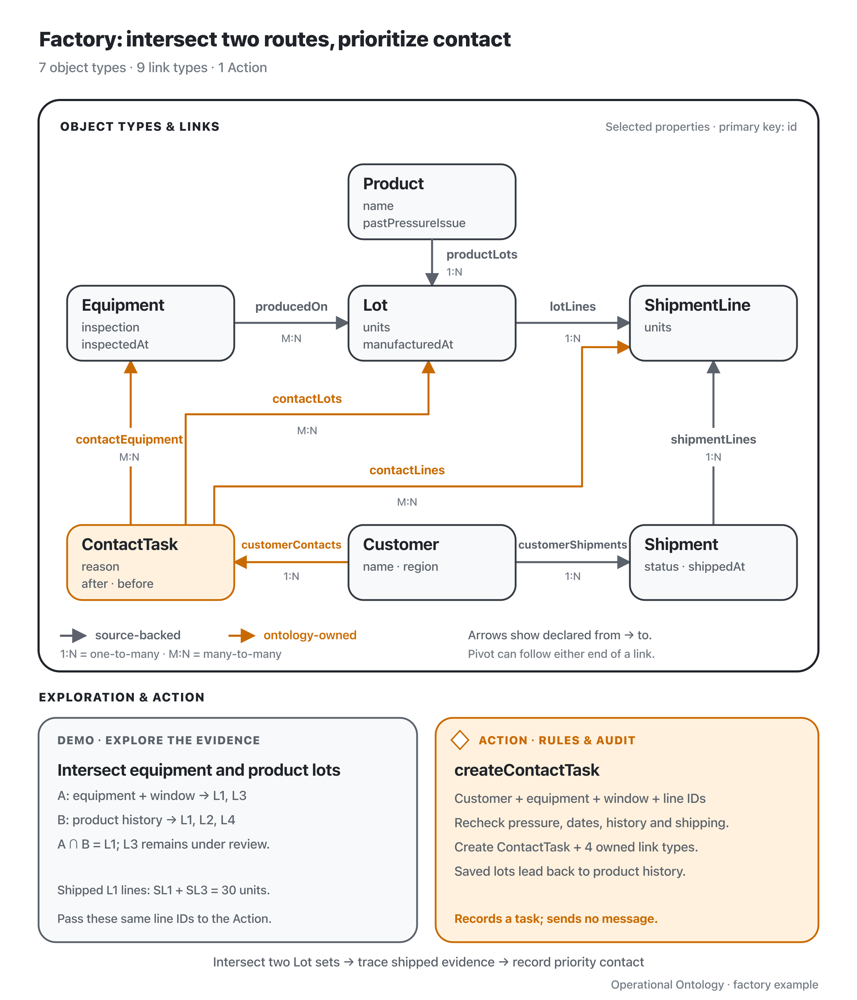

**English** | [日本語](./README.ja.md)

# Factory: intersect equipment findings and product history

Run `pnpm demo:factory` from the repository root. The demo uses synthetic MES and WMS databases and an in-memory ontology store; each run starts fresh.

On September 8, an inspection finds a pressure anomaly on PRESS-1. Quality staff investigate lots manufactured on that equipment on September 6, the supplied investigation window. Separately, the product catalog records past pressure-related quality issues for product P-A. Staff prioritize lots that meet both conditions, trace their shipped quantities and customers, and record a contact/reinspection task.

The history concerns earlier lots, and product specifications are assumed unchanged. Each lot belongs to one product number. The catalog's `pastPressureIssue` records relevant history, not a verdict on current lots. Release inspections passed before the September 7 shipments; current defects are unconfirmed, and the demo does not infer when the equipment fault began.



Gray: source-backed state. Orange: ontology-owned state. The diagram shows all object and link types, with selected properties. [Editable SVG](./assets/ontology-overview.svg).

[`demo.ts`](./demo.ts) follows two independent routes: Equipment → Lot and Product → Lot. It uses filter, pivot and set operations directly, printing input and result types, IDs and counts at each step:

| Step | Result |
| --- | --- |
| Route A: filter pressure-anomalous equipment, pivot to lots, filter manufacturing window | PRESS-1 → **A = {L1, L3}** |
| Route B: independently filter product catalog by past pressure issues, pivot to lots | P-A → **B = {L1, L2, L4}** |
| Intersect the Lot sets to prioritize investigation | **A ∩ B = {L1}** |
| Subtract the priority set from A; keep the remaining investigation scope | L3 remains under review |
| Pivot from L1 to shipment lines | SL1, SL3, SL5 |
| Pivot to shipments and filter shipped status | S1, S2 |
| Pivot from shipped shipments back to all their lines | SL1, SL6, SL3, SL4 |
| Intersect shipped contents with priority-lot lines | SL1, SL3 |
| Pivot from shipped shipments to customers | C1 (Aoba), once |
| Sum units on the retained lines | **10 + 20 = 30** |
| Create a task with those same evidence IDs | CONTACT-C1 and five links |

L1 is both equipment-related and associated with product history. L2 shares product P-A but was made September 5; L4 shares P-A but was made on PRESS-3. L3 was made on the suspect equipment in the window, but belongs to P-B, which has no recorded pressure-related issue. **L3 remains a potentially affected lot: absence of history is not evidence of safety.** The intersection selects priority work, not the entire set of potentially affected goods or a confirmed cause.

C1 is found through L1's shipped S1 and S2, once despite the two paths. C2 received out-of-window L2; C3's 10 units of L1 have not shipped. A second intersection retains the priority lot's shipped lines: it excludes unshipped SL5, SL4 from remaining L3, and SL6 from L4 on another press. SL1 and SL3 total 30 units. L1 totals 40 including unshipped goods; S1 and S2 total 55 including other lots. Summing shipment-line quantities avoids both overcounts, and those same line IDs become the Action's evidence.

The operator executes `createContactTask`. The Action rechecks the pressure anomaly, manufacturing window, each lot's current product history, customer and shipped-line evidence. It atomically creates an ontology-owned task with links to the customer, equipment, lot and lines. The saved lot also leads back to its Product, so both routes can be inspected. The task sends no message, changes no shipment or lot status, and does not close the remaining investigation. Re-indexing preserves tasks and evidence links; these identify source records rather than freezing their historical contents.

## Related video

This video covers the earlier scenario, before the product-catalog route was added. Its target lots and quantities differ from the current demo above.

**[▶ Ontology: Investigative Analysis Explained | Factory (English narration, 6:02)](https://www.youtube.com/watch?v=kQFvOResIvI)**

<a href="https://www.youtube.com/watch?v=kQFvOResIvI">
  
</a>

## Code and MCP

Start with [`demo.ts`](./demo.ts), then the Action and its rules in [`ontology.ts`](./ontology.ts). `fixtures.ts` and `integrate.ts` supply existing source facts; `runtime.ts` wires model reads to the runtime. Source write-back is covered in [orders](../orders/ontology.ts), candidate Functions and allocation in [hospital](../hospital/README.md), and shared recipients in [finance](../finance/README.md).

Run `pnpm mcp:factory`, or connect from the repository root with:

```sh
claude --strict-mcp-config --mcp-config examples/factory/.mcp.json
```

The server generates read/pivot/set/aggregate tools and `create_contact_task` from the model. Agents filter returned objects in their own code execution environment and pass selected IDs to the next tool. `pivot_produced_on` and `pivot_product_lots` produce the two routes' Lot sets; `intersect_lot` selects priority lots and `subtract_lot` retains the remainder. After following shipments, `intersect_shipment_line` retains the shipped evidence to sum and pass to the Action. The MCP test in `scenario.test.ts` exercises this sequence; no Function completes the exploration for the caller. Runtime contracts are in [IMPLEMENTATION.md](../../IMPLEMENTATION.md). This example assumes one writer and visibility of all resources relevant to a decision.
