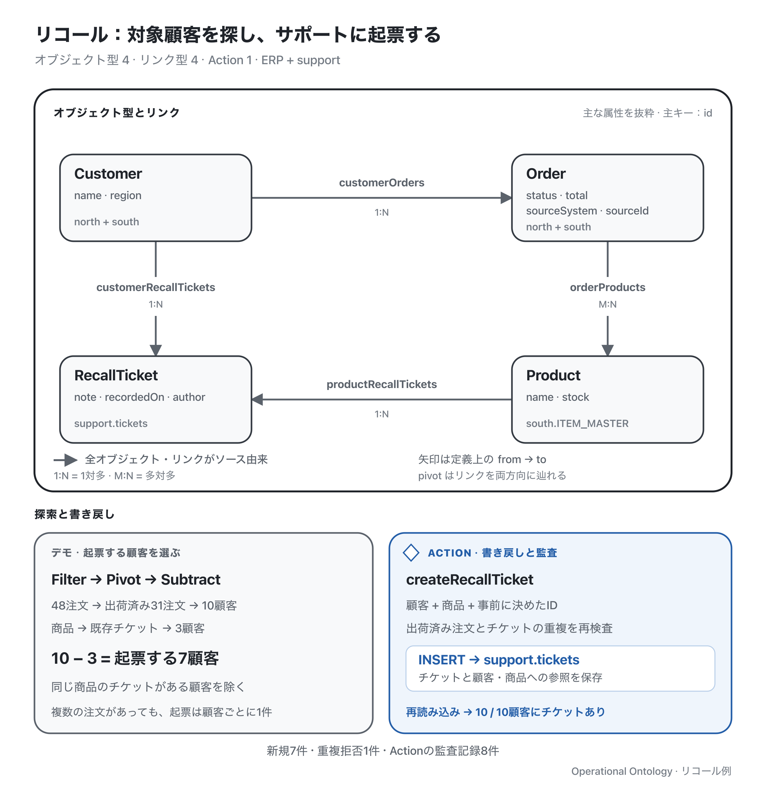

[English](./README.md) | **日本語**

# リコール：仕入れ先からの連絡を受け、交換対応チケットを作る

2026年9月10日、仕入れ先のキーボード会社から「ITM-101 のキースイッチに不具合が判明したため、対象品を交換する」と連絡が来ました。カスタマーサポートは、出荷済み注文の顧客を調べ、まだチケットがない顧客の交換連絡チケットを作成します。



グレーはソース由来のオブジェクトとリンク、青はActionとサポートへの書き戻しです。全オブジェクト型・リンク型を示し、属性は抜粋しています。[編集用 SVG](./assets/ontology-overview.ja.svg)。

リポジトリのルートで実行します。

```sh
pnpm demo:recall
```

デモは「出荷済み注文を探す」「チケットがない顧客を絞る」「起票する」「結果を確認する」の4段階です。仕入れ先から通知された商品を起点にします。前日に3社から電話があり、その既存チケットは手順2の照合で見つかります。

## ソースシステムとOntology

ソースとして3つの独立したインメモリSQLiteを使い、別にOntologyストアを持ちます。実行するたびに初期状態から始まります。

| ソースシステム | 所有するデータ | このシナリオでの役割 |
| --- | --- | --- |
| `north`：ERP A | 顧客・注文・注文明細 | 全300注文の半分を提供 |
| `south`：ERP B | 顧客・注文・注文明細・商品マスタ | 残り半分の注文と商品情報を提供 |
| `support`：カスタマーサポートシステム | 交換連絡チケットと顧客・商品への参照 | 既存3件を提供し、新規チケットを受け付ける |

統合処理は、両ERPで異なるスキーマやステータスコードを `Customer`・`Order`・`Product` に揃えます。`RecallTicket` は `support.tickets` のレコードを表します。

4種類のオブジェクトと4種類のリンクは、すべてsource-backedです。チケットから顧客・商品への関連は、サポート側のレコードにある参照から読み込みます。チケットには注文ID一覧を保持しません。orders例とCustomer–Order–Productの構造を共有し、担当者・ノート・visibilityの設定は省いています。

## 1. 対象キーボードを含む出荷済み注文を探す

`Product/ITM-101` を取得し、`orderProducts` を逆方向にtraverseして、その商品を含む注文を探します。次に `status === 'shipped'` でfilterします。

```text
商品 ITM-101 → traverse → 48注文 → filter → 出荷済み31注文
```

全体は300注文です。キーボードを含む48注文のうち、14件は未出荷、3件はキャンセル済みです。出荷済み31注文は10顧客の繰り返し購入で、各顧客に3〜4注文あります。出荷状態から分かるのは出荷実績であり、顧客による受領までは確認できません。

## 2. この商品のチケットがない顧客を絞る

出荷済み注文から `customerOrders` を逆方向にpivotします。同じ顧客が重複排除され、31注文が10顧客にまとまります。

同じ商品から `productRecallTickets` を辿ると既存チケットが3件あり、そこから `customerRecallTickets` を逆方向にpivotすると、前日に電話した3顧客が得られます。この顧客集合を、対象の10顧客から差し引きます。

```text
出荷済み31注文 → pivot → 対象10顧客
商品 ITM-101 → チケット → pivot → 既存チケットがある3顧客
対象10顧客 − 既存チケットがある3顧客 → 起票する7顧客
```

`subtract` の両側はCustomer集合です。商品から既存チケットを辿るため、別商品のチケットがあるだけの顧客は除外されません。

## 3. 選んだ顧客のチケットをサポートシステムに作る

7顧客それぞれに `createRecallTicket` を実行します。渡すのは、顧客ID・商品ID・呼び出し側で決めたチケットID・説明文・日付・記録者です。呼び出し側で注文一覧を組み立てたり、選んだ集合を別のモデルへ変換したりする必要はありません。

Actionは実行時点のインデックス済みデータで再検査します。

| 検査する条件 | 拒否コード |
| --- | --- |
| 商品が存在する | `UNKNOWN_PRODUCT` |
| 同じ顧客・商品のチケットがまだない | `RECALL_TICKET_ALREADY_EXISTS` |
| この顧客に、この商品を含む出荷済み注文がある | `NO_SHIPPED_ORDER` |

Actionは `writeback: true` を宣言し、チケット作成と2つのリンクをサポート用アダプタに渡します。アダプタは1回のSQL `INSERT` で、顧客・商品への参照を持つチケットとして3つの編集を保存します。その後、ランタイムがローカルのオブジェクト・リンク・監査記録をコミットします。7回の呼び出しはそれぞれ独立したトランザクションで、成功するたびに1件のチケットが作られます。

サポート側のテーブルにも `(customer_id, product_id)` の一意制約があります。インデックス後にソースで同じチケットが作られていた場合、INSERTが失敗し、ローカルにチケットを作らず `WRITEBACK_FAILED` を返します。注文の適合条件はインデックス済みのERPデータで確認し、3システム全体を1つのトランザクションにはしません。

## 4. 重複拒否と再読み込み後の網羅性を確認する

前日からチケットがある顧客にもう1件作成しようとすると、Actionが `RECALL_TICKET_ALREADY_EXISTS` で拒否します。

続いて、3つのソースからスナップショットを読み直します。商品から10件のチケット、その顧客へ辿り、対象顧客との差集合を取ります。結果が空なら、対象10顧客すべてにチケットがあると確認できます。

| 結果 | 件数 |
| --- | --- |
| 既存のサポートチケット | 3件 |
| 新規作成したサポートチケット | 7件 |
| 再読み込み後にチケットがある対象顧客 | 10/10顧客 |
| Actionの監査記録 | 8件：適用7件、重複拒否1件 |

既存チケットはサポートシステムから読み込むため、OntologyのAction監査記録は発生しません。チケットが記録するのは今後の連絡予定です。このデモはメッセージを送信せず、連絡・交換の完了を記録せず、注文や在庫も変更しません。監査記録にはActionの入力と結果が残り、探索経路や注文のスナップショットは残りません。

## コードとMCP

4段階の流れは [`demo.ts`](./demo.ts)、Actionとルールは [`ontology.ts`](./ontology.ts)、INSERTは [`support-adapter.ts`](./support-adapter.ts) にあります。[`fixtures.ts`](./fixtures.ts) がソースデータを作り、[`integrate.ts`](./integrate.ts) がスナップショットを組み立て、[`runtime.ts`](./runtime.ts) が接続します。[`scenario.test.ts`](./scenario.test.ts) で一連の流れ・拒否・ソースでの競合・再インデックス・MCP経由の操作を確認しています。

`pnpm mcp:recall` で起動します。リポジトリのルートからは次でも接続できます。

```sh
claude --strict-mcp-config --mcp-config examples/recall/.mcp.json
```

同じモデルから `get_product`・`traverse_order_products`・`pivot_customer_orders`・`subtract_customer`・`create_recall_ticket` などのツールを公開します。MCPクライアントは取得した注文を自身のコードでfilterし、選択したIDを次のツールへ渡します。人もエージェントも同じActionを実行します。この例は単一の書き込み元と、判断に必要な全データが見えることを前提とします。詳細は[ランタイムの契約](../../docs/IMPLEMENTATION.ja.md)を参照してください。
