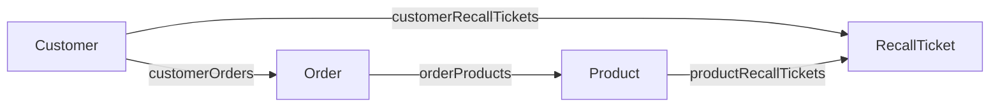

**English** | [日本語](./README.ja.md)

# Recall: from a supplier notice to support tickets

On September 10, 2026, our keyboard supplier reports a defective key switch in ITM-101 and requests an exchange of affected units. Customer support needs to find customers with shipped orders and create an exchange-contact ticket for each customer who does not already have one.

Run the scenario from the repository root:

```sh
pnpm demo:recall
```

The demo follows four steps: find shipped orders, identify customers without tickets, create tickets, and verify the result. It starts with the product named by the supplier. Three customers phoned the day before; their existing tickets are discovered when checking coverage in step 2.

## Systems and ontology

The example uses three separate in-memory SQLite source databases and an ontology store. Each run starts fresh.

| Source system | Owns | Role in this scenario |
| --- | --- | --- |
| `north` — ERP A | Customers, orders and order lines | Supplies half of the 300 orders |
| `south` — ERP B | Customers, orders, order lines and the product master | Supplies the other half and the product data |
| `support` — customer-support system | Exchange-contact tickets and their customer/product references | Supplies three existing tickets and accepts new tickets |

Integration normalizes the two ERPs' different schemas and status codes into `Customer`, `Order` and `Product`. `RecallTicket` represents a record in `support.tickets`.



All four object types and all four links are source-backed. A ticket's customer and product links come from the references on its support record. Tickets do not retain a list of order IDs. The example shares the orders model's Customer–Order–Product structure and omits its assignee, notes and visibility policy.

## 1. Find shipped orders containing the recalled keyboard

Get `Product/ITM-101`, then traverse `orderProducts` in reverse to find the orders containing it. Filter those orders by `status === 'shipped'`.

```text
Product ITM-101 → traverse → 48 orders → filter → 31 shipped orders
```

The full dataset contains 300 orders. Of the 48 keyboard orders, 14 are pending and three are cancelled. The 31 shipped orders belong to ten customers, each with three or four repeat purchases. Shipment status establishes that an order shipped; it does not establish customer receipt.

## 2. Identify customers without a ticket for this product

Pivot the shipped orders through `customerOrders` in reverse. Pivot deduplicates the customers, so 31 orders become ten customers.

From the same product, traverse `productRecallTickets` to its three existing tickets, then pivot those tickets through `customerRecallTickets` in reverse. These are the three customers who phoned yesterday. Subtract this customer set from the ten affected customers.

```text
31 shipped orders → pivot → 10 affected customers
Product ITM-101 → tickets → pivot → 3 customers with existing tickets
10 affected customers − 3 customers with tickets → 7 customers to act on
```

Both operands of `subtract` are Customer sets. Starting the ticket lookup from the product ensures that a ticket for another product does not exclude a customer.

## 3. Create a support ticket for each selected customer

For each of the seven selected customers, call `createRecallTicket` with the customer ID, product ID, a caller-supplied ticket ID, note, date and author. The caller does not assemble an order list or transform the selected set into another model.

The Action rechecks the current indexed state:

| Check | Refusal |
| --- | --- |
| The product exists | `UNKNOWN_PRODUCT` |
| No ticket exists for this customer and product | `RECALL_TICKET_ALREADY_EXISTS` |
| This customer has a shipped order containing this product | `NO_SHIPPED_ORDER` |

With `writeback: true`, the Action sends its ticket creation and two links to the support adapter. One SQL `INSERT` persists all three edits as a ticket row with customer and product references. The runtime then commits the local object, links and audit entry. The seven calls are separate transactions; each successful call creates one ticket.

The support table also enforces uniqueness of `(customer_id, product_id)`. If another ticket appeared at the source after indexing, the INSERT fails and the runtime returns `WRITEBACK_FAILED` without creating a local ticket. Order eligibility is checked against the indexed ERP data; this is not a transaction across all three systems.

## 4. Verify refusal and coverage after re-indexing

Try creating another ticket for one of yesterday's customers. The Action refuses it with `RECALL_TICKET_ALREADY_EXISTS`.

Reload the snapshot from all three source systems. Traverse from the product to its ten tickets, pivot to their customers, and subtract those customers from the affected set. An empty result confirms coverage of all ten customers.

| Result | Count |
| --- | --- |
| Existing support tickets | 3 |
| New support tickets | 7 |
| Affected customers with a ticket after reload | 10/10 |
| Action audit entries | 8: seven applied, one duplicate rejected |

The existing tickets were loaded from support, so they do not generate ontology Action audit entries. Tickets record planned contact; the demo sends no messages and does not record contact or exchange completion. It does not change orders or inventory. The audit retains Action inputs and outcomes, not the exploration path or an order snapshot.

## Code and MCP

Read [`demo.ts`](./demo.ts) for the four-step flow, [`ontology.ts`](./ontology.ts) for the Action and its rules, and [`support-adapter.ts`](./support-adapter.ts) for the INSERT. [`fixtures.ts`](./fixtures.ts) creates the source data, [`integrate.ts`](./integrate.ts) builds the snapshot, and [`runtime.ts`](./runtime.ts) connects them. [`scenario.test.ts`](./scenario.test.ts) exercises the flow, refusals, source conflicts, re-indexing and MCP calls.

Run `pnpm mcp:recall`, or connect from the repository root:

```sh
claude --strict-mcp-config --mcp-config examples/recall/.mcp.json
```

The same model exposes tools such as `get_product`, `traverse_order_products`, `pivot_customer_orders`, `subtract_customer` and `create_recall_ticket`. MCP clients filter returned orders in their own code and pass selected IDs to the next tool. Human and agent callers execute the same Action. This example assumes one writer and visibility of all resources relevant to a decision; see the [runtime contracts](../../docs/IMPLEMENTATION.md).
